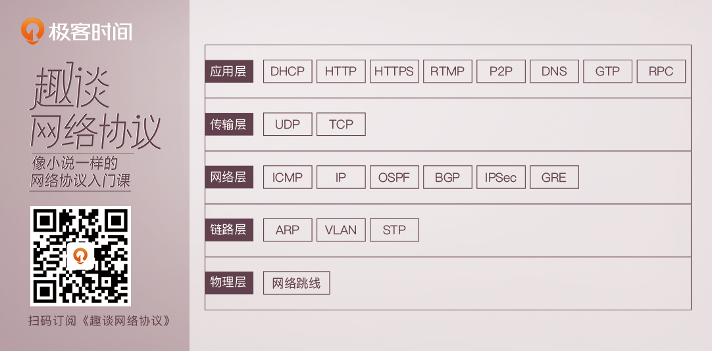

# 01. 为什么要学习网络协议



## 层级之间的真实调用方式如何？协议栈开销？

TCP比较复杂，以UDP为例。

```c
// 发送包是一个sk_buff结构
int udp_send_skb(struct sk_buff *skb, struct flowi4 *fl4)
// UDP调用IP层函数
int ip_send_skb(struct net *net, struct sk_buff *skb)
// ip层通过路由判断，把包发给下层
int ip_output(struct net *net, struct sock *sk, struct sk_buff *skb)
// 发送的时候要进行ARP。如果有MAC，则调用二层的函数，neigh是邻居系统，二层的意思
int neigh_output(struct neighbour *n, struct sk_buff *skb)

// 接收的时候，会调用这里的接收函数。
int netif_receive_skb(struct sk_buff *skb)
// 这个函数会根据是 ARP 或者 IP 等，选择调用不同的函数。如果是 IP 协议的话，就调用这里的函数。
int ip_rcv(struct sk_buff *skb, struct net_device *dev, struct packet_type *pt, struct net_device *orig_dev)
// 这里也有路由判断。如果是本地的，则继续往上提交这个结构。
int ip_local_deliver(struct sk_buff *skb)
// 接着，还是根据 IP 头里面的协议号，来判断是什么协议，从而调用什么函数。下面这个是对 UDP 的调用。
int udp_rcv(struct sk_buff *skb)
```
